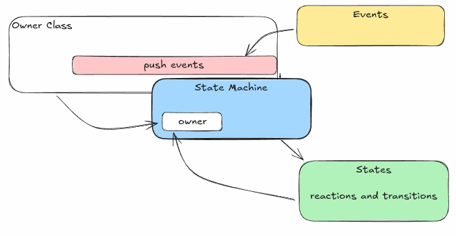

# COYOT3PP::STATEMACHIN3


## INTRODUCTION

This component includes state machine tools macros, constructed as a wrapper from the `boost::statechart` library.

These macros are meant to help to build a state machine processor components:

* Events
* States
  * transitions
* State Machine
  * owner class
  * initial state.

> To really understand this macros, the reader should study the mechanisms of `boost state-chart`.
>
> [https://www.boost.org/doc/libs/1_78_0/libs/statechart/doc/index.html](https://www.boost.org/doc/libs/1_78_0/libs/statechart/doc/index.html)



## MACROS :

### EVENTS ORIENTED:

Macros to ease the `boost::statechart::event<T>`.

`CYT3MACRO_boost_statechart_event_simple`: `_declarations` and `_definitions`


#### Parameters:

* `eventName` : the event name, as will be defined at the event structure
* `extraArgumentType` : parameter not required : type of an extra parameter that will be included at the constructor, and as the parameter `param`.
* `eventDescription` : helper to include in the code the meaning and use of the event. If needed, can be found at the parameter `description`.


#### Expansion:

Creates:

* constructor without `extraArgumentType`:
  * `EventClass(const std::string& r = std::string())`
* constructor with `extraArgumentType`:
  * `EventClass(const extraArgumentType& parameter, const std::string& r = std::string())`
* destructor...
  

#### Example:

```cpp

CYT3MACRO_boost_statechart_event_simple_declarations(EvStartStop   , int , This is a simple event created at the documentation.)

CYT3MACRO_boost_statechart_event_simple_definitions(EvSimple    , int , This is a simple event created at the documentation.)


```

To access the events:

```cpp
EvSimple ev(6,"created for documentation purposes");
ev.param == 6 //true
std::cout << ev.description;

//or directly pushing it to the state machine.
push_state_machine_event_(new EvSimple(6,"created for documentation purposes"));
```


### STATES ORIENTED

Macros to wrap `boost::statechart::state<T>`.

`CYT3MACRO_boost_statechart_state` , `_declarations` and `_definitions`

#### Parameters:

* `stateName` : state-struct name.
* `parentStateOrFsm` : parent state-struct or state-machine-struct name
* `defaultChildState` : not required. to mention if the state contains inner states
* `extraParams` : list of extra parameters for the state machine
  * 1st: `paramHistory`: may include parameters such as :
    * `boost::statechart::has_deep_history`
    * `constructor-extra` : function that will be called when the constructor is called
    * `destructor extra` : function that will be called when the destructor is called
    * `event-confirm-transition` : if not null, it will post an event to confirm transition actions.
* `extraPropsAndMethods` : extra proprery and methods to be included at the state-structure
* `variadic-arguments` : sequence of pairs that will contain the reactions to events.
  * 1st of pair : the event to react to
  * 2nd of pair : if defined, the transition will be automatically implemented. if not defined, it will be that the user implements a method with the form of `sc::result stateName::react(const 1stOfPair& e)`

#### Expansion:

#### Example:

> From the `StopWatch` state machine example at [https://www.boost.org/doc/libs/1_88_0/libs/statechart/doc/tutorial.pdf](https://www.boost.org/doc/libs/1_88_0/libs/statechart/doc/tutorial.pdf)


```cpp
  // at .hpp
  struct Stopped;
  CYT3MACRO_boost_statechart_state_declarations(Active,
                                   StopWatch,
                                   Stopped,
                                   ( , on_construct, on_destruct, ),
                                   ( ),
                                   EvReset  , Active,
                                   EvCustom , 
  )

  CYT3MACRO_boost_statechart_state_declarations(Running, 
                                  Active, 
                                  , 
                                  ( , on_construct , on_destruct, ),
                                  ( int64_t run_interval), 
                                  EvStartStop, Stopped

  )
  CYT3MACRO_boost_statechart_state_declarations(Stopped, 
                                  Active, 
                                  , 
                                  ( , on_construct , , ),
                                  ( ), 
                                  EvStartStop, Start
  )
  // at .cpp
  CYT3MACRO_boost_statechart_state_definitions(Active,
                                   StopWatch,
                                   Stopped,
                                   ( , on_construct, on_destruct, ),
                                   ( ),
                                   EvReset   , Active,
                                   EvCustom  , 
  )
  CYT3MACRO_boost_statechart_state_definitions(Running, 
                                  Active, 
                                  , 
                                  ( , on_construct , on_destruct , ),
                                  ( ),
                                  EvStartStop, Stopped

  )
  CYT3MACRO_boost_statechart_state_definitions(Stopped, 
                                  Active, 
                                  , 
                                  ( , on_construct , , ),
                                  EvStartStop, Start
  )
  
  void Active::on_construct(){
    // some ops here
    outermost_context().reset_initial_time();
  }
  void Active::on_destruct(){
    // some ops here
  }
  boost::statechart::result Active::react(const EvCustom& e){
    // some ops here
    if( somethin ){
      return boost::statechart::forward_event();
    }else if( anotherthing ){
      return boost::statechart::discard_event();
    }
    return boost::statechart::Inactive();
  }

  void Running::on_construct(){
    run_time = coyot3::tools::get_current_timestamp();
  }
  void Running::on_destruct(){
    int64_t now = cotot3::tools::get_current_timestamp();
    outermost_context().add_total_active_time(now - run_time);
  }

```

### STATE MACHINE ORIENTED

For the naming of the state machine, it is assumed that the state machine will be attached to a class.

MAcros oriented to define the state machine itself.

To define the state machine at header it is necessary to:
* invoke the header macro
* invoke the implementation declarations **at the global namespace**
* invoke the state machine macro

#### HEADER:

`CYT3MACRO_boost_statechart_header`

##### Parameters:

* `stateMachineOwnerClass` : owner class name. Will be attached the postfix `StateMachine`.
  * Example: `stateMachineOwnerClass = StopWatch` will be expanded to `StopWatchStateMachine`
* `initialState` : name of the initial state structure.

##### Example:

```cpp
namespace my::namespace{
  CYT3MACRO_boost_statechart_header(StopWatch, Active)
}
```

#### IMPLEMENTATION DECLARATIONS

`CYT3MACRO_boost_statechart_implementation_declarations`

##### Parameters:

* `stateMachineOwnerClass` : owner class name. Will be attached the postfix `StateMachine`.
  * Example: `stateMachineOwnerClass = StopWatch` will be expanded to `StopWatchStateMachine`
* `initialState` : name of the initial state structure.

##### Example:

```cpp
CYT3MACRO_boost_statechart_implementation_declarations(StopWatch, Active)
```

#### STATE-MACHINE

`CYT3MACRO_boost_statechart_machine_declarations`

##### Parameters:

* `stateMachineOwnerClass` : owner class name. Will attach the postfix `StateMachine`.
* `initialState` : initial state structure.
* `attachedClass` : not required. If defined, will be used as the reference class to integrate the `owner` property.
* `additionalPublicMethodsAndProperties` : additional methods and properties that will be accessible to the states throw the `outermost_context()` states method. The implementation of the methods will correspond to the user.
* `additionalProtectedMethodsAndProperties` : additional methods that will be declared for the class. The implementation of the methods will be done by the user.


